# OpenWiki Home

Welcome to the **fvctools OpenWiki** — the comprehensive documentation hub for the Flyvercity CLI Tools Suite. This wiki organizes knowledge across major domains to help you understand, use, extend, and contribute to fvctools effectively.

## 🗺️ Navigation Map

Explore the key domains of fvctools through these curated guides and references.

```mermaid
graph TD
    A[OpenWiki Home] --> B[Quickstart]
    A --> C[Architecture]
    A --> D[Domain Models]
    A --> E[Operations]
    A --> F[Integrations]
    A --> G[Testing]
    A --> H[Workflows]
    
    B -->|Learn by doing| B1[Installation & Setup]
    B -->|First steps| B2[Basic Commands]
    B -->|Tutorial| B3[Complete Workflow]
    
    C --> C1[Architecture Overview]
    C --> C2[Data Formats Guide]
    C --> C3[CLI Tools Reference]
    
    D --> D1[Domain Formats & Models]
    D --> D2[Flight Log Model]
    D --> D3[Radar Log Model]
    D --> D4[Geospatial Models]
    
    E --> E1[Development Setup]
    E --> E2[Production Setup]
    E --> E3[Development Practices]
    
    F --> F1[Polars Integration]
    F --> F2[External Library Guides]
    
    G --> G1[Testing Overview]
    G --> G2[Best Practices]
    G --> G3[Quality Assurance]
    
    H --> H1[Data Conversion Workflows]
    H --> H2[Validation Workflows]
    H --> H3[Correlation & Fusion]
```



---

## 🚀 Quickstart

**Start here** if you're new to fvctools or want to get hands-on quickly.

| Guide | Description | When to Use |
|-------|-------------|-------------|
| **[Quickstart Guide](/openwiki/quickstart.md)** | Complete end-to-end tutorial: install, convert, validate, visualize | You're new to fvctools or want a hands-on introduction |

**What you’ll learn:**
- Install fvctools using uv or scripts
- Convert aviation formats (NMEA, ULog, SAFIR MQTT, etc.) to the unified .fvc format
- Validate converted data
- Analyze flight logs and generate interactive visualizations
- Run batch processing and quality control pipelines

**Quick links:**
```bash
# Install and verify
uv pip install -e ".[dev]"
fvc --version

# Convert NMEA to .fvc
fvc df flight.nmea convert nmea flight.fvc

# Validate
fvc df flight.fvc validate

# Visualize
fvc render fl flight.fvc --output ./map
```

---

## 🏗️ Architecture

Understand how fvctools is structured, designed, and extended.

| Guide | Description | Focus Areas |
|-------|-------------|-------------|
| **[Architecture Overview](/openwiki/architecture/overview.md)** | High-level architecture, components, and design principles | Modular design, CLI-centric architecture, data-centric operations, performance optimizations |
| **[Data Formats Guide](/openwiki/architecture/data-formats.md)** | Deep dive into the Flyvercity Data Format (.fvc) and schema | JSON-Lines format, METADATA records, schema validation, supported content types |
| **[CLI Tools Reference](/openwiki/architecture/tools.md)** | Complete reference for all CLI commands and subcommands | `fvc df`, `fvc calc`, `fvc render`, `fvc tools`, argument structure, global options |

**Key concepts:**
- **Modularity**: Separation of concerns across toolsets
- **CLI-first**: Consistent, scriptable interface using Click
- **Data-centric**: All operations revolve around the .fvc format
- **Performance**: Polars-based optimizations for large datasets

**Architecture diagram:**
```
┌───────────────────────────────────────────────────────────────┐
│                        fvctools CLI                           │
├─────────────────┬─────────────────┬─────────────────┬─────────┤
│    fvc df       │    fvc calc     │   fvc render    │  fvc    │
│  (Data File)    │ (Calculations)  │ (Visualization) │  tools  │
└────────┬────────┴────────┬────────┴────────┬────────┴─────────┘
         │                 │                 │
         ▼                 ▼                 ▼
┌─────────────────┐ ┌─────────────┐ ┌─────────────────┐
│  Core Libraries │ │ Core Libs   │ │  Core Libraries │
│  (Conversion)   │ │ (Calc)      │ │ (Visualization) │
└────────┬────────┘ └──────┬──────┘ └───────┬─────────┘
         │                 │                │
         ▼                 ▼                ▼
┌───────────────────────────────────────────────────────────────┐
│                     Data Format (.fvc)                         │
│  ┌─────────────┐    ┌─────────────┐    ┌───────────────────┐  │
│  │  METADATA   │    │  FLIGHTLOG  │    │    RADARLOG       │  │
│  │  Record     │    │  Record     │    │    Record         │  │
│  └─────────────┘    └─────────────┘    └───────────────────┘  │
└───────────────────────────────────────────────────────────────┘
```

---

## 🧩 Domain Models

Explore the domain-specific data models and business logic that power fvctools.

| Guide | Description | Core Models |
|-------|-------------|-------------|
| **[Domain Formats & Models](/openwiki/domain/formats.md)** | Reference for domain-specific formats, data models, and business logic | Flight log, radar log, geospatial models, identifiers, metadata, conversion context |

**What you’ll find:**
- **Flight Log Domain Model**: Position, attitude, velocity, status, events, temporal structure
- **Radar Log Domain Model**: Surveillance data, track models, sensor fusion
- **Geospatial Models**: Coordinate systems, altitude models, quality metrics
- **Identifier Systems**: UAID, ICAO, aircraft registration, internal IDs
- **Metadata Model**: Describes .fvc file content and provenance

**Example flight log record:**
```json
{
  "time": {"unix": 1756033206882, "iso": "2025-08-01T12:00:06.882Z"},
  "uaid": {"icaohex": "ABC123", "icaoreg": "VH-XYZ"},
  "pos": {"loc": {"lat": 52.3, "lon": 4.9, "alt": 100.5}, "heading": 270.5},
  "quality": {"hdop": 1.2, "vdop": 0.8, "satellites": 12}
}
```

---

## ⚙️ Operations

Set up and manage fvctools in development and production environments.

| Guide | Description | Key Topics |
|-------|-------------|------------|
| **[Development Setup](/openwiki/operations/setup.md)** | Complete guide to setting up fvctools for development and production | Python 3.12+, uv, Git, Node.js, installation methods, environment configuration |
| **[Development Practices](/openwiki/operations/development.md)** | Best practices for development, code quality, and contribution workflows | Linting, formatting, pre-commit, testing, CI/CD, Git workflows |

**Prerequisites checklist:**
- ✅ Python 3.12+
- ✅ uv package manager
- ✅ Git
- ✅ Node.js (for OpenWiki)

**Installation methods:**
```bash
# Development (editable)
uv pip install -e ".[dev]"

# Production
uv pip install .

# Verify
fvc --version
```

**Development workflow:**
```bash
# Install dev dependencies
uv pip install -e ".[dev]"

# Run tests
pytest

# Check code quality
ruff check src/fvc
ruff format src/fvc

# Run pre-commit
pre-commit run --all-files
```

---

## 🔗 Integrations

Learn how fvctools integrates with external libraries and systems for maximum performance and extensibility.

| Guide | Description | Integration Points |
|-------|-------------|-------------------|
| **[Polars Integration Guide](/openwiki/integrations/polars.md)** | Comprehensive guide to using Polars for high-performance data processing | Format converters (AgentFly, DatCon, SenHive, SAFIR MQTT v2), lazy evaluation, parallel processing |

**Why Polars?**
- ✅ 10–100x faster than pure Python for large datasets
- ✅ 50% less memory usage with Float32
- ✅ Automatic multi-core parallelization
- ✅ Lazy evaluation for memory efficiency

**Format converters using Polars:**
| Converter | Location | Performance Gain |
|-----------|----------|------------------|
| AgentFly | `/src/fvc/tools/df/xformats/agentfly.py` | High |
| DatCon | `/src/fvc/tools/df/xformats/datcon.py` | High |
| SenHive | `/src/fvc/tools/df/xformats/senhive.py` | High |
| SAFIR MQTT v2 | `/src/fvc/tools/df/xformats/safirmqtt_v2.py` | Medium |

---

## 🧪 Testing

Ensure reliability, correctness, and maintainability with fvctools’ testing strategies and tools.

| Guide | Description | Tools & Practices |
|-------|-------------|-------------------|
| **[Testing Overview & Best Practices](/openwiki/testing/overview.md)** | Overview of testing strategies, tools, and best practices | pytest, test pyramid, TDD, isolation, determinism, performance testing |

**Testing philosophy:**
- ✅ **Test Pyramid**: Unit (60–70%), Component (20–30%), Integration/E2E (10–20%)
- ✅ **TDD**: Write tests first or alongside implementation
- ✅ **Quality**: Fast, isolated, deterministic, readable, maintainable, comprehensive

**Testing tools:**
- ✅ **pytest**: Primary testing framework
- ✅ **Fixtures**: For test setup and teardown
- ✅ **Parallel execution**: Speed up test runs
- ✅ **Coverage**: Measure and enforce test coverage

**Example test:**
```python
# test_example.py
def test_addition():
    assert 1 + 1 == 2

def test_conversion_output():
    result = convert_nmea_to_fvc("sample.nmea")
    assert result.is_valid()
    assert len(result.records) > 0
```

---

## 🔄 Workflows

Master the end-to-end data processing workflows that make fvctools powerful.

| Guide | Description | Key Workflows |
|-------|-------------|---------------|
| **[Data Conversion Workflows](/openwiki/workflows/conversion.md)** | Comprehensive guide to data conversion, validation, and correlation | Format detection, parsing, schema validation, correlation, batch processing |
| **[Validation Workflows](/openwiki/workflows/validation.md)** | Guide to validation strategies and quality assurance | Schema validation, METADATA checks, content validation, quality metrics |

**Supported formats:**
| Format | Description | Status |
|--------|-------------|--------|
| **NMEA** | Standard GPS protocol | ✅ Complete |
| **ULog** | PX4 flight controller logs | ✅ Complete |
| **SAFIR MQTT** | Telemetry streaming | ✅ Complete |
| **DatCon** | Flight recorder format | ✅ Complete |
| **SenHive** | Flight logging system | ✅ Complete |
| **AgentFly** | Simulator logs | ✅ Complete |
| **GeoJSON** | Geographic features | ✅ Complete |
| **KML** | Google Earth format | ✅ Complete |
| **ART** | ART log format | ✅ Complete |
| **CS Group** | CS Group logs | ✅ Complete |
| **Gnettrack** | Gnettrack logs | ✅ Complete |
| **Robin Radar** | Robin Radar XML | ✅ Complete |

**Typical conversion pipeline:**
```
External Format Input
       ↓
Format-Specific Parser (xformats/*.py)
       ↓
Unified .fvc Format Output
       ↓
Validation & Quality Checks
       ↓
Downstream Processing
```

---

## 📚 Additional Resources

| Resource | Description |
|----------|-------------|
| **[GitHub Repository](https://github.com/flyvercity/fvctools)** | Source code, issues, discussions, and releases |
| **[Schema Documentation](/docs/schema/README.md)** | Detailed schema definitions for .fvc and domain models |
| **[Test Files](/tests/)** | Example test files and sample data |
| **[Flyvercity Website](https://flyvercity.com)** | Company and product information |

---

## 🛠️ How to Use This Wiki

1. **Start with Quickstart** if you're new to fvctools
2. **Use Architecture guides** to understand the system design
3. **Refer to Domain Models** when working with data structures
4. **Follow Operations guides** to set up your environment
5. **Learn Integrations** to optimize performance
6. **Apply Testing practices** to ensure code quality
7. **Master Workflows** for data processing pipelines

---

## 🤝 Contributing

fvctools is an open-source project! Contributions are welcome from the community.

**Ways to contribute:**
- Report bugs and suggest features via GitHub Issues
- Add support for new aviation formats
- Improve documentation and guides
- Write tests and increase coverage
- Optimize performance and memory usage
- Share integration examples

**Get involved:**
1. Fork the repository
2. Create a feature branch
3. Add tests and documentation
4. Submit a pull request

---

## 🆘 Getting Help

| Issue Type | Where to Go |
|------------|-------------|
| **Documentation** | Check this OpenWiki and linked guides |
| **Installation problems** | [Development Setup](/openwiki/operations/setup.md) |
| **Usage questions** | GitHub Discussions |
| **Bug reports** | GitHub Issues |
| **Feature requests** | GitHub Issues |

**Quick help:**
```bash
# Check CLI help
fvc --help
fvc df --help
fvc df convert --help

# Enable debug logging
export FVC_LOG_LEVEL=DEBUG
fvc df --in input.nmea convert nmea output.fvc
```

---

## 🎉 Next Steps

Ready to dive deeper? Pick a path:

- 🚀 **[Quickstart Guide](/openwiki/quickstart.md)** → Get hands-on fast
- 🏗️ **[Architecture Overview](/openwiki/architecture/overview.md)** → Understand the system
- 🧩 **[Domain Formats & Models](/openwiki/domain/formats.md)** → Master data structures
- ⚙️ **[Development Setup](/openwiki/operations/setup.md)** → Set up your environment
- 🔗 **[Polars Integration Guide](/openwiki/integrations/polars.md)** → Optimize performance
- 🧪 **[Testing Overview](/openwiki/testing/overview.md)** → Ensure quality
- 🔄 **[Data Conversion Workflows](/openwiki/workflows/conversion.md)** → Process your data

---

**Welcome to the fvctools community!** 🎊

If you have questions, issues, or ideas, don’t hesitate to reach out.

Happy data processing! ✈️
