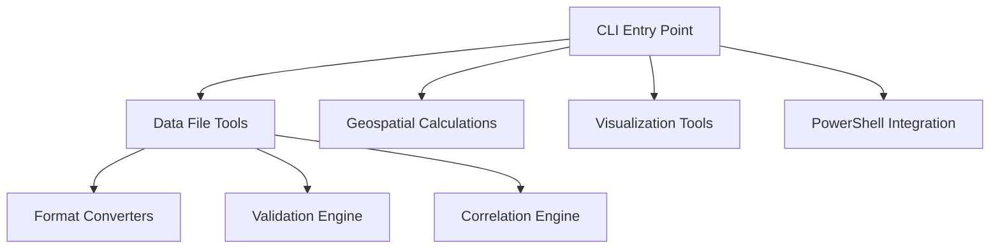
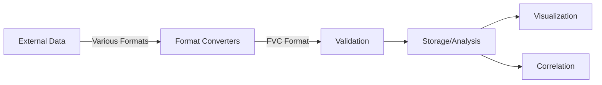

# Architecture Overview

The Flyvercity CLI Tools Suite (`fvctools`) follows a modular, tool-based architecture designed for processing geospatial aviation data.

## Core Components

### CLI Entry Point

The main entry point is `fvc.tools.cli:main` which routes commands to appropriate toolsets.

### Data File Tools (`fvc df`)

The core data processing toolset handles:
- **Conversion**: Transforms external formats to unified FVC format
- **Validation**: Ensures FVC files comply with project schemas
- **Correlation**: Synchronizes and merges multiple log files

### Geospatial Calculations (`fvc calc`)

Provides specialized geospatial utilities:
- **Undulation**: EGM96 geoid calculations
- **Terrain**: Digital Elevation Model lookups

### Visualization Tools (`fvc render`)

Generates interactive visualizations for flight data analysis.

### PowerShell Integration (`fvc shell`)

Windows-specific integration that treats CLI outputs as PowerShell objects.

## Data Flow

## Key Design Principles

1. **Modularity**: Each toolset is independent and focused on specific functionality
2. **Unified Data Format**: All tools work with the FVC format for consistency
3. **Performance**: Recent optimizations using Polars for data processing
4. **Cross-platform**: Supports both Unix and Windows environments

## Relationships

- **Data Formats**: The architecture relies on the [FVC data format](data-formats.md) as the unifying standard
- **Tools Implementation**: See [Tools Architecture](tools.md) for implementation details
- **Conversion Workflows**: The architecture supports the [data conversion workflows](workflows/conversion.md)

## Source References

- Main CLI: `src/fvc/tools/cli.py`
- Data File Tools: `src/fvc/tools/df/`
- Geospatial Tools: `src/fvc/tools/calc/`
- Render Tools: `src/fvc/tools/render/`