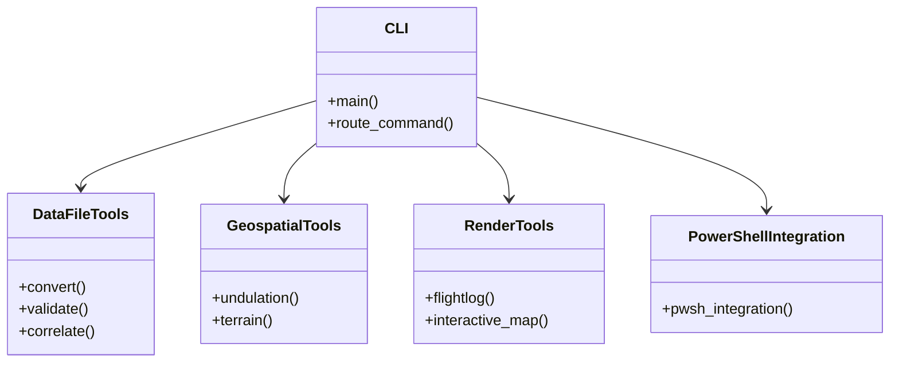
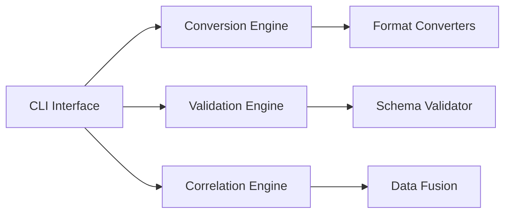
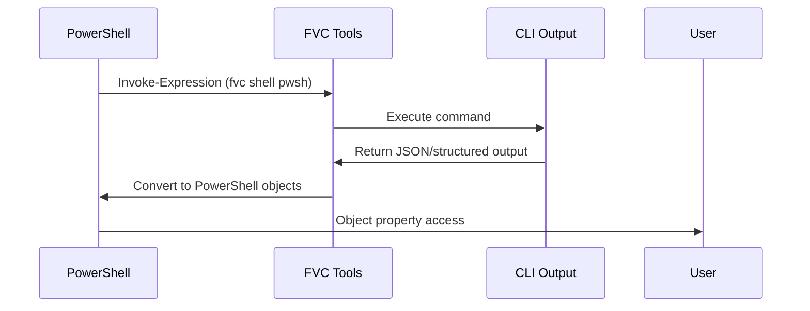

# Tools Architecture

The Flyvercity CLI tools follow a modular, command-based architecture with specialized toolsets.

## Toolset Organization



## Data File Tools Architecture

### Core Components



### Conversion Engine

- **Entry Point**: `src/fvc/tools/df/cli.py`
- **Core Logic**: `src/fvc/tools/df/core.py`
- **Format Converters**: `src/fvc/tools/df/xformats/`

Each format converter implements:
```python
def convert_to_fvc(params, metadata, input_path, output):
    """Convert external format to FVC format"""
    # Implementation uses optimized data processing
```

### Recent Optimizations

The conversion engine has been optimized with **Polars** for several formats:
- AgentFly: Uses Polars for efficient data frame operations
- Senhive: Optimized with Polars for large dataset processing
- CSGroup: Polars-based conversion pipeline
- ART Log: Polars optimization for log processing
- ULog: Polars integration for binary log conversion

## Geospatial Tools Architecture

### Components

- **Undulation Calculator**: Uses EGM96 geoid model
- **Terrain Calculator**: Uses Digital Elevation Models (DEM)
- **Coordinate Utilities**: Geodesy calculations

## Render Tools Architecture

### Components

- **Flight Log Visualization**: Interactive HTML maps
- **Data Export**: Various output formats
- **Template Engine**: Jinja2-based rendering

## PowerShell Integration

### Architecture



## Implementation Patterns

### Unified I/O

All tools use a consistent I/O pattern:
- Input: File paths, parameters, and metadata
- Processing: Format-specific logic with validation
- Output: FVC format or other standardized outputs

### Error Handling

- Comprehensive error handling with rich error messages
- Validation at multiple stages
- Graceful degradation for partial data

### Performance Optimization

- **Polars Integration**: Recent optimizations use Polars for:
  - Efficient data frame operations
  - Parallel processing capabilities
  - Memory-efficient data handling
- **Streaming**: Large file processing without full memory loading
- **Caching**: Reuse computed geospatial data

## Relationships

- **Polars Integration**: The tools leverage [Polars optimization](integrations/polars.md) for performance
- **Conversion Workflows**: Tools implement the [data conversion workflows](workflows/conversion.md)
- **Data Formats**: Tools work with the [FVC data format](data-formats.md)

## Source References

- Main CLI: `src/fvc/tools/cli.py`
- Data File CLI: `src/fvc/tools/df/cli.py`
- Core Processing: `src/fvc/tools/df/core.py`
- Format Converters: `src/fvc/tools/df/xformats/`
- Geospatial Tools: `src/fvc/tools/calc/`
- Render Tools: `src/fvc/tools/render/`
- PowerShell Integration: `src/fvc/tools/notebook/`