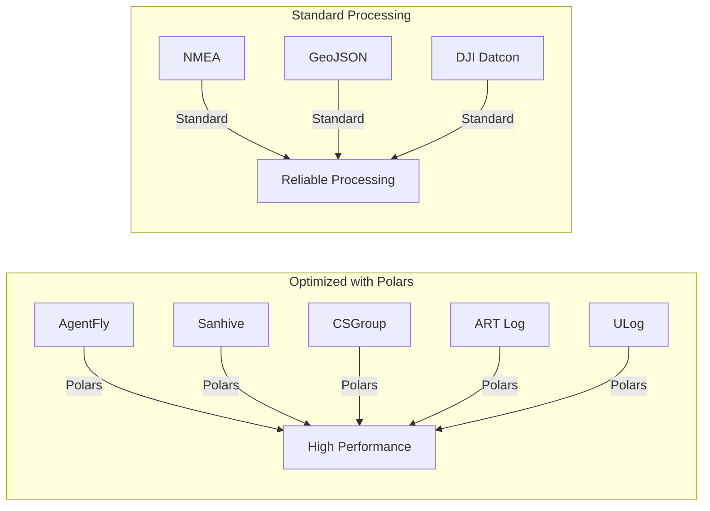

# Supported Data Formats

Flyvercity CLI tools support conversion from a variety of aviation and geospatial data formats to the unified FVC format.

## Format Catalog

### AgentFly

- **Description**: AgentFly simulator logs
- **Module**: `src/fvc/tools/df/xformats/agentfly.py`
- **Optimization**: Recently optimized with Polars for performance
- **Typical Use**: Drone simulation data conversion

### ART Log

- **Description**: ART log format
- **Module**: `src/fvc/tools/df/xformats/artlog.py`
- **Optimization**: Polars-based optimization
- **Typical Use**: ART system log processing

### Courageous

- **Description**: Courageous project logs
- **Module**: `src/fvc/tools/df/xformats/courageous.py`
- **Typical Use**: Courageous platform data

### CS Group

- **Description**: CS Group logs
- **Module**: `src/fvc/tools/df/xformats/csgroup.py`
- **Optimization**: Polars integration for efficient processing
- **Typical Use**: CS Group aviation data

### DJI Datcon

- **Description**: DJI Datcon logs
- **Module**: `src/fvc/tools/df/xformats/datcon.py`
- **Typical Use**: DJI drone flight logs

### GeoJSON

- **Description**: GeoJSON format
- **Module**: `src/fvc/tools/df/xformats/geojson.py`
- **Features**: Supports complex geospatial features
- **Typical Use**: Geospatial data integration

### Gnettrack

- **Description**: Gnettrack logs
- **Module**: `src/fvc/tools/df/xformats/gnettrack.py`
- **Typical Use**: Tracking system data

### KML

- **Description**: Keyhole Markup Language
- **Module**: `src/fvc/tools/df/xformats/kml/`
- **Typical Use**: Geospatial visualization data

### Manna

- **Description**: Manna format
- **Module**: `src/fvc/tools/df/xformats/manna.py`
- **Typical Use**: Manna system logs

### NMEA

- **Description**: NMEA GPS logs
- **Module**: `src/fvc/tools/df/xformats/nmea.py`
- **Features**: Standard GPS data format
- **Typical Use**: GPS receiver logs

### Robin Radar

- **Description**: Robin Radar XML
- **Module**: `src/fvc/tools/df/xformats/robinradar.py`
- **Typical Use**: Radar system data

### Safir MQTT

- **Description**: Safir MQTT logs
- **Modules**: `src/fvc/tools/df/xformats/safirmqtt.py`, `src/fvc/tools/df/xformats/safirmqtt_v2.py`
- **Typical Use**: MQTT-based sensor data

### Senhive

- **Description**: Senhive logs
- **Module**: `src/fvc/tools/df/xformats/senhive.py`
- **Optimization**: Recently optimized with Polars
- **Typical Use**: Senhive platform data

### PX4 ULog

- **Description**: PX4 ULog logs
- **Module**: `src/fvc/tools/df/xformats/ulog.py`
- **Optimization**: Polars integration for binary log processing
- **Typical Use**: PX4 autopilot flight logs

## Format Comparison



## Format Selection Guide

### By Performance Requirements

| Requirement | Recommended Formats |
|-------------|---------------------|
| High Performance | AgentFly, Senhive, CSGroup, ART Log, ULog (Polars-optimized) |
| Standard Processing | NMEA, GeoJSON, DJI Datcon, etc. |
| Large Datasets | Polars-optimized formats for memory efficiency |

### By Data Source

| Source Type | Recommended Formats |
|-------------|---------------------|
| Drone Simulators | AgentFly, PX4 ULog |
| GPS Receivers | NMEA |
| Aviation Systems | CSGroup, ART Log |
| Geospatial Data | GeoJSON, KML |
| Radar Systems | Robin Radar |
| Sensor Networks | Senhive, Safir MQTT |

## Format Implementation Details

### Converter Interface

All format converters implement the same interface:

```python
def convert_to_fvc(params, metadata, input_path, output):
    """
    Args:
        params (dict): CLI parameters and custom options
        metadata (dict): Metadata to be written as the first line
        input_path (Path): Path to the source file
        output (JsonlinesIO): Unified IO handler for writing .fvc records
    """
    # Format-specific implementation
```

### Conversion Process

1. **Parse Input**: Read and parse format-specific data
2. **Transform Data**: Convert to FVC record structure
3. **Write Output**: Write records using JsonlinesIO
4. **Handle Errors**: Format-specific error handling

## Relationships

- **Conversion Workflows**: These formats are processed by the [data conversion workflows](workflows/conversion.md)
- **Tools Architecture**: Format converters are part of the [tools architecture](architecture/tools.md)
- **FVC Format**: All formats convert to the unified [FVC data format](architecture/data-formats.md)
- **Polars Integration**: Optimized formats use [Polars integration](integrations/polars.md)

## Source References

- Format Converters: `src/fvc/tools/df/xformats/`
- Conversion Core: `src/fvc/tools/df/core.py`
- Format Tests: `tests/test_*_xformat.py`