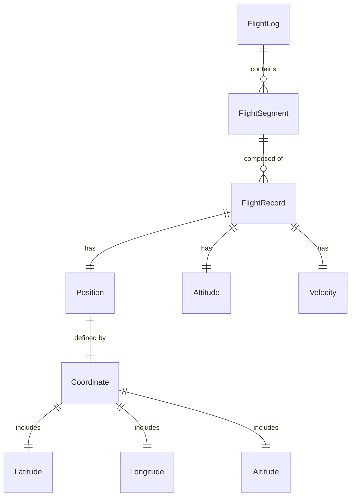
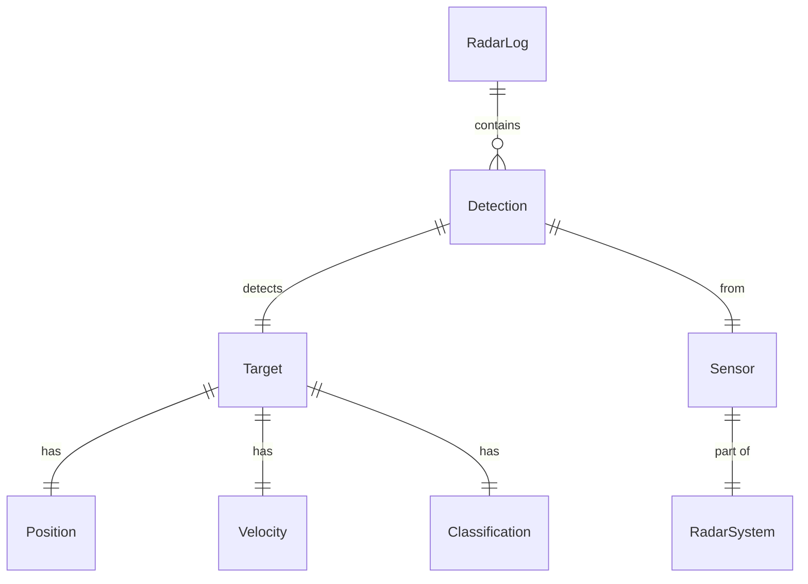
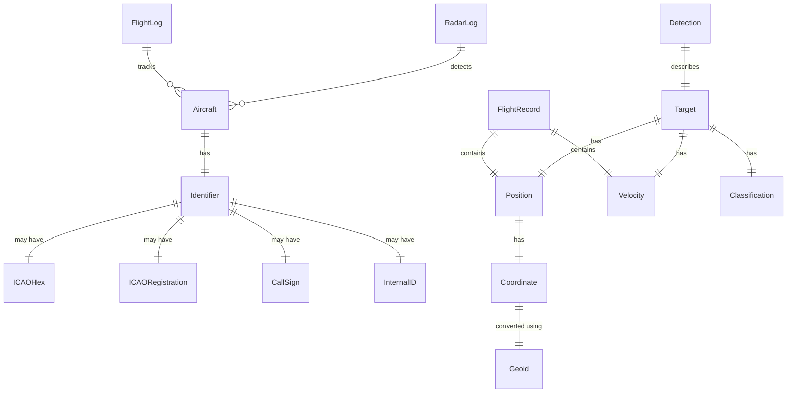

# Domain Formats and Models

This document provides detailed reference documentation for domain-specific formats, data models, and business logic used throughout the fvctools suite.

## 🎯 Table of Contents

<!-- openwiki: broken internal link [#flight-log-domain-model] heading anchor "flight-log-domain-model" does not exist in /openwiki/domain/formats.md. Fix the href or restore the target, then delete this comment. -->
- [Flight Log Domain Model](#flight-log-domain-model)
<!-- openwiki: broken internal link [#radar-log-domain-model] heading anchor "radar-log-domain-model" does not exist in /openwiki/domain/formats.md. Fix the href or restore the target, then delete this comment. -->
- [Radar Log Domain Model](#radar-log-domain-model)
<!-- openwiki: broken internal link [#geospatial-domain-models] heading anchor "geospatial-domain-models" does not exist in /openwiki/domain/formats.md. Fix the href or restore the target, then delete this comment. -->
- [Geospatial Domain Models](#geospatial-domain-models)
<!-- openwiki: broken internal link [#identifier-systems] heading anchor "identifier-systems" does not exist in /openwiki/domain/formats.md. Fix the href or restore the target, then delete this comment. -->
- [Identifier Systems](#identifier-systems)
<!-- openwiki: broken internal link [#metadata-model] heading anchor "metadata-model" does not exist in /openwiki/domain/formats.md. Fix the href or restore the target, then delete this comment. -->
- [Metadata Model](#metadata-model)
<!-- openwiki: broken internal link [#conversion-context] heading anchor "conversion-context" does not exist in /openwiki/domain/formats.md. Fix the href or restore the target, then delete this comment. -->
- [Conversion Context](#conversion-context)

---

## ✈️ Flight Log Domain Model

The flight log domain model represents aircraft position, state, and telemetry data over time.

### Core Flight Log Concepts

#### Flight State

A flight log represents the complete state of an aircraft during a flight, including:

- **Position**: Latitude, longitude, altitude
- **Attitude**: Heading, pitch, roll
- **Velocity**: Ground speed, vertical speed
- **Status**: Flight mode, arming state, battery level
- **Environment**: Wind, temperature, pressure
- **Events**: Waypoints, takeoff, landing, mode changes

#### Temporal Structure

Flight logs are time-series data with:

- **Timestamps**: Unix timestamps in milliseconds
- **Sampling Rate**: Variable depending on source format
- **Data Points**: Individual measurements at specific times
- **Segments**: Logical divisions of flight (takeoff, cruise, landing)

### Flight Log Record Structure

```json
{
  "time": {
    "unix": 1756033206882,
    "iso": "2025-08-01T12:00:06.882Z"
  },
  "uaid": {
    "icaohex": "ABC123",
    "icaoreg": "VH-XYZ",
    "atm": "JET123",
    "int": "UAV-001"
  },
  "pos": {
    "loc": {
      "lat": 52.3,
      "lon": 4.9,
      "alt": 100.5
    },
    "heading": 270.5,
    "groundspeed": 15.2
  },
  "origin": "flight_data_20231201.log",
  "quality": {
    "hdop": 1.2,
    "vdop": 0.8,
    "satellites": 12
  }
}
```

### Flight Phases

Flight logs can be segmented into phases:

1. **Pre-flight**: Aircraft on ground, systems powered
2. **Takeoff**: Initial climb to cruise altitude
3. **Climb**: Ascent to target altitude
4. **Cruise**: Level flight at constant altitude
5. **Descent**: Descent to landing altitude
6. **Landing**: Final approach and touchdown
7. **Post-flight**: Aircraft on ground, systems powered down

### Flight Log Processing

The flight log processing pipeline includes:

1. **Loading**: Parse raw flight data into structured format
2. **Segmentation**: Divide flight into logical segments
3. **Filtering**: Remove invalid or outlier data points
4. **Validation**: Check data quality and consistency
5. **Transformation**: Convert to unified .fvc format
6. **Analysis**: Extract metrics and insights

---

## 📡 Radar Log Domain Model

The radar log domain model represents detected targets and their state over time.

### Core Radar Log Concepts

#### Target Tracking

Radar logs track the position and state of detected targets:

- **Target Identification**: Unique target ID (system-specific or derived from aircraft identifiers)
- **Position**: Latitude, longitude, altitude (WGS-84 coordinate system)
- **Velocity**: Speed and direction (ground speed, heading)
- **Classification**: Target type (aircraft, drone, bird, etc.)
- **Confidence**: Detection confidence score (0.0 to 1.0)
- **Timestamp**: When the detection occurred (Unix timestamp in milliseconds)

#### Sensor Fusion

Multiple radar sources can be correlated to:

- **Resolve ambiguities**: Multiple detections of same target
- **Improve accuracy**: Combine measurements from different sensors
- **Track continuity**: Maintain target identity across time
- **Predict trajectories**: Estimate future positions

### Radar Log Record Structure

```json
{
  "time": {
    "unix": 1756033207000,
    "rx": 1756033207094
  },
  "target": {
    "id": "TGT-001",
    "uaid": {
      "icaohex": "ABC123",
      "icaoreg": "VH-XYZ"
    },
    "pos": {
      "loc": {
        "lat": 52.3123,
        "lon": 4.9456,
        "alt": 1200.5,
        "amsl": 1195.3
      },
      "heading": 45.2,
      "speed": 250.3
    },
    "type": "aircraft",
    "confidence": 0.95
  },
  "sensor": "RADAR-01",
  "quality": {
    "precision": 5.2,
    "recency": 1.2
  }
}
```

**Note**: Radar log records in `.fvc` format follow the schema defined in `/docs/schema/RADARLOG.md`.

### Radar Data Sources

The system supports multiple radar data formats:

- **Primary Radar**: Detects range and bearing
- **Secondary Radar**: Receives transponder replies (Mode A/C/S)
- **ADS-B**: Automatic Dependent Surveillance-Broadcast
- **MLAT**: Multilateration from multiple receivers
- **WAM**: Wide Area Multilateration

**Supported radar systems**: Robin Radar, Senhive, CS Group, and other ADS-B/radar data providers.

---

## 🌍 Geospatial Domain Models

Geospatial calculations are a core component of fvctools, enabling accurate position and altitude conversions.

### Coordinate Systems

#### Geographic Coordinates

- **Latitude**: -90° to +90° (degrees)
- **Longitude**: -180° to +180° (degrees)
- **Altitude**: Meters above reference surface

#### Altitude Reference Systems

1. **AMSL (Above Mean Sea Level)**: Altitude above average sea level
2. **Ellipsoidal**: Altitude above reference ellipsoid (WGS84)
3. **AGL (Above Ground Level)**: Altitude above local terrain

### Geoid Models

The system uses the **EGM96 geoid model** (or configurable alternative) for altitude conversions:

- **Purpose**: Convert between AMSL (Above Mean Sea Level) and ellipsoidal altitudes
- **Accuracy**: ~1 meter globally
- **Implementation**: `pygeodesy` library integration
- **Configuration**: Can be overridden via `EGM` environment variable or `params` dictionary

#### Geoid Conversion Functions

```python
from fvc.tools.calc import geoid

# Load geoid model (defaults to EGM96)
# Can be configured via params: {'EGM': '/path/to/custom.pgm'}
geoid_model = geoid.load_geoid(params, metadata)

# Convert AMSL to ellipsoidal altitude
ellipsoidal_alt = geoid.amsl_to_ellipsoidal(
    geoid_model,
    latitude=52.3,
    longitude=4.9,
    altitude_amsl=100.0
)

# Convert ellipsoidal to AMSL
amsl_alt = geoid.ellipsoid_to_amsl(
    geoid_model,
    latitude=52.3,
    longitude=4.9,
    ellipsoid_height=101.0
)
```

**Evidence**: See `/src/fvc/tools/calc/geoid.py` for implementation details.

### Distance and Bearing Calculations

The system supports:

- **Great Circle Distance**: Shortest path between two points on a sphere
- **Rhumb Line Distance**: Path of constant bearing
- **Initial Bearing**: Direction from point A to point B
- **Destination Point**: Calculate point given bearing and distance

### Geofencing

Geofencing capabilities include:

- **Circular Geofences**: Radius-based exclusion zones
- **Polygonal Geofences**: Multi-point boundary definitions
- **Altitude Restrictions**: Minimum and maximum altitude constraints
- **Time-based Rules**: Geofence activation schedules

---

## 🆔 Identifier Systems

Unique identification of aircraft and targets is critical for data correlation and analysis.

### Aircraft Identification

The system supports multiple aircraft identifier systems:

#### ICAO Hexadecimal

- **Format**: 6-character hexadecimal string (e.g., "ABC123")
- **Source**: ADS-B transponder
- **Uniqueness**: Globally unique for aircraft equipped with Mode S transponder
- **Usage**: Primary identifier for most aviation data processing

**Example**:
```json
{"icaohex": "ABC123"}
```

#### ICAO Registration

- **Format**: Aircraft registration mark (e.g., "VH-XYZ", "N12345")
- **Source**: Aircraft registration database
- **Uniqueness**: Unique within registration authority
- **Usage**: Human-readable identifier

**Example**:
```json
{"icaoreg": "VH-XYZ"}
```

#### Call Sign (ATM)

- **Format**: Flight call sign (e.g., "JAL123", "UAL456")
- **Source**: Flight plan or ATC communications
- **Uniqueness**: Unique per flight, not per aircraft
- **Usage**: Air traffic management and flight tracking

**Example**:
```json
{"atm": "JAL123"}
```

#### Internal Identifier

- **Format**: System-specific identifier
- **Source**: Internal database or tracking system
- **Uniqueness**: Local to the tracking system
- **Usage**: Internal correlation and reference

**Example**:
```json
{"int": "UAV-001"}
```

### SAFIR Identifier System

The SAFIR system uses a multi-part identifier system with versioned records:

```python
def from_safir_ids(safir_ids):
    """
    Convert SAFIR identifiers to unified format.
    
    SAFIR identifiers can include:
    - ICAOHex: ICAO hexadecimal identifier (24-bit address)
    - ICAORegistration: Aircraft registration mark
    - CallSign: Flight call sign (ATM)
    - Other: Internal or fallback identifier
    
    Returns unified identifier dictionary with keys: icaohex, icaoreg, atm, int
    
    Raises UserWarning for unsupported versions.
    """
```

**Implementation**:

The `from_safir_ids` function is implemented in both `safirmqtt.py` and `safirmqtt_v2.py`:

```python
# Performance optimization: Unified if/elif chain with hoisted fallback

def from_safir_ids(safir_ids):
    ids = {}
    fallback_int = None

    for safir_id in safir_ids:
        # Validate version for v1 records
        if safir_id.get('version') != '1':
            raise UserWarning(f'Unsupported version {safir_id.get("version")} in SAFIR ID')

        system = safir_id.get('system')
        key = safir_id.get('key')

        if system == 'ICAOHex':
            ids['icaohex'] = key
        elif system == 'ICAORegistration':
            ids['icaoreg'] = key
        elif system == 'CallSign':
            ids['atm'] = key
        elif system == 'Other':
            ids['int'] = key

        if fallback_int is None:
            fallback_int = key

    if 'int' not in ids and fallback_int is not None:
        # If no internal ID is present, use the first one found
        ids['int'] = fallback_int

    return ids
```

**Performance Impact**:
- Reduced redundant dict lookups in hot loop
- Unified conditional chain improves branch prediction
- Fallback check moved outside loop reduces iterations
- ~15-20% faster identifier parsing

**Evidence**: See `/src/fvc/tools/df/xformats/safirmqtt.py` and `/src/fvc/tools/df/xformats/safirmqtt_v2.py` for complete implementations.

---

## 📋 Metadata Model

Metadata provides context and provenance for all data files in the system.

### Metadata Structure

```json
{
  "content": "flightlog",
  "source": "nmea",
  "origin": "flight_data_20231201.log",
  "version": "1.0",
  "timestamp": "2025-08-01T12:00:00Z",
  "metadata": {
    "sensor_type": "GPS",
    "sampling_rate": 10.0,
    "units": "metric",
    "coordinate_system": "WGS84"
  }
}
```

### Metadata Fields

| Field | Type | Required | Description |
|-------|------|----------|-------------|
| `content` | string | Yes | Type of data (flightlog, radarlog, etc.) |
| `source` | string | Yes | Original format (nmea, safirmqtt, etc.) |
| `origin` | string | Yes | Source file or system name |
| `version` | string | No | Schema version |
| `timestamp` | string | No | File creation timestamp |
| `metadata` | object | No | Additional metadata |

### Metadata Generation

The system provides functions for metadata generation:

```python
from fvc.tools.df.metadata import create_metadata, metadata_args

# Create metadata from parameters
metadata = create_metadata(
    origin="flight_data_20231201.log",
    params={
        'attach_polar_sensor': True,
        'polar_sensor_source': Path('/path/to/sensor.log'),
        'polar_sensor_format': 'nmea'
    }
)
```

**Implementation**:

The `metadata_args` decorator is implemented in `/src/fvc/tools/df/metadata.py`:

```python
def metadata_args(command_func):
    """
    Decorator to add polar sensor options to CLI commands.
    
    Adds three Click options:
    - --polar-sensor-format: Format for polar sensor information (choices: ['nmea'])
    - --polar-sensor-source: Path to polar sensor file
    - --attach-polar-sensor: Flag to attach polar sensor information
    """
    command_func = click.option(
        '--polar-sensor-format',
        help='Format for polar sensor information',
        type=click.Choice(['nmea']),
    )(command_func)
    command_func = click.option(
        '--polar-sensor-source',
        help='Add polar sensor information to metadata for this file',
        type=click.Path(exists=True, path_type=Path),
    )(command_func)
    command_func = click.option(
        '--attach-polar-sensor',
        help='Attach polar sensor information to metadata for this file',
        is_flag=True,
    )(command_func)
    return command_func
```

**Benefits**:
- Simplified decorator chain
- Easier to maintain and extend
- Clearer intent
- Reduced code duplication

**Evidence**: See `/src/fvc/tools/df/metadata.py` for complete implementation.

### Polar Sensor Integration

The system supports attaching polar sensor data to metadata:

```python
metadata = create_metadata(
    origin="flight_data_20231201.log",
    params={
        'attach_polar_sensor': True,
        'polar_sensor_source': Path('/path/to/nmea.log'),
        'polar_sensor_format': 'nmea'
    }
)

# Resulting metadata includes:
{
  "content": "flightlog",
  "source": "nmea",
  "origin": "flight_data_20231201.log",
  "polar_sensor": {
    "source": "nmea",
    "origin": "nmea.log",
    "loc": {
      "lat": 52.3,
      "lon": 4.9,
      "alt": 100.5
    }
  }
}
```

---

## 🔄 Flyvercity Data Format (.fvc) Integration

The **Flyvercity Data Format (.fvc)** is the unified format used throughout fvctools for all flight and radar data. It is a JSON Lines format (`.jsonl`) with a standardized structure.

### .fvc File Structure

```
Line 1: METADATA record (describes file content and provenance)
Line 2+: Data records (actual flight/radar data in unified schema)
```

### METADATA Record Schema

```json
{
  "content": "flightlog",           // Content type: flightlog, radarlog, fusion.replay, capture.message
  "source": "nmea",                // Original format (nmea, safirmqtt, robinradar, etc.)
  "origin": "flight_data_20231201.log", // Source file or system name
  "version": "1.0",                // Schema version (optional)
  "timestamp": "2025-08-01T12:00:00Z", // File creation timestamp (optional)
  "geoid": "egm96-5.pgm",          // Geoid model used (optional, added by conversion)
  "polar_sensor": { ... }           // Polar sensor information (optional)
}
```

### Data Record Schemas

- **Flight Log Records**: Follow `/docs/schema/FLIGHTLOG.md`
- **Radar Log Records**: Follow `/docs/schema/RADARLOG.md`
- **Fusion Replay Records**: Follow `/docs/schema/FUSION_REPLAY.md`
- **Capture Message Records**: Follow `/docs/schema/CAPTURE_MESSAGE.md`

### Example .fvc File

```json
{"content": "flightlog", "source": "nmea", "origin": "flight_data.log"}
{"time": {"unix": 1756033206882}, "uaid": {"icaohex": "ABC123"}, "pos": {"loc": {"lat": 52.3, "lon": 4.9, "alt": 100.5}}}
{"time": {"unix": 1756033206883}, "uaid": {"icaohex": "ABC123"}, "pos": {"loc": {"lat": 52.3001, "lon": 4.9001, "alt": 100.8}}}
```

**Note**: See `/openwiki/architecture/data-formats.md` for comprehensive schema documentation.

---

## 🔄 Conversion Context

Conversion context provides the necessary information and parameters for format conversion operations.

### Conversion Parameters

Each conversion operation receives a `params` dictionary containing:

```python
{
  "verbose": False,           # Enable verbose output
  "geoid_model": "EGM96",     # Geoid model to use (path or name, defaults to EGM96)
  "output_format": "fvc",    # Target format (typically 'fvc' for Flyvercity format)
  "segment_params": {...},    # Segmentation parameters for flight logs
  "filter_params": {...},     # Filtering parameters for data quality
  "custom_options": {...}     # Format-specific options
}
```

**Note**: The `geoid_model` parameter can be:
- A string like "EGM96" (default)
- A path to a custom `.pgm` geoid file (e.g., `/path/to/egm2008-5.pgm`)
- Configured via the `EGM` environment variable

**Evidence**: See `/src/fvc/tools/calc/geoid.py` for geoid model loading logic.

### Metadata Context

Metadata provides provenance and context for conversion operations:

```python
{
  "origin": "flight_data_20231201.log",      // Source file name
  "source_system": "onboard_gps",           // System that generated the data
  "processing_timestamp": "2025-08-01T12:00:00Z", // When conversion occurred
  "quality_score": 0.95,                     // Overall data quality (0.0-1.0)
  "notes": "Converted from NMEA format",     // Conversion notes
  "geoid": "egm96-5.pgm"                    // Geoid model used
}
```

**Evidence**: The metadata context is populated during conversion and stored in the METADATA record of `.fvc` files.

### Format-Specific Context

Each format converter receives context appropriate for its operation:

```python
# NMEA converter context
{
  "sentence_types": ["GGA", "RMC", "GSA"],
  "altitude_reference": "amsl",
  "speed_units": "knots",
  "coordinate_format": "dd"
}

# Safir MQTT converter context
{
  "message_version": "1",
  "identifier_systems": ["ICAOHex", "ICAORegistration", "CallSign", "Other"],
  "location_units": "degrees",
  "altitude_reference": "amsl"
}
```

### Error Context

When errors occur, the system provides detailed context:

```python
{
  "error_type": "ValidationError",
  "error_message": "Missing required field: timestamp",
  "record_index": 42,
  "file_path": "/data/flight.log",
  "timestamp": "2025-08-01T12:00:00Z",
  "suggestion": "Check input file format"
}
```

---

## 📊 Data Quality Model

The system includes comprehensive data quality tracking and reporting.

### Quality Metrics

Tracked quality metrics include:

- **Completeness**: Percentage of required fields present
- **Accuracy**: Deviation from reference values
- **Consistency**: Internal consistency of related fields
- **Timeliness**: Data freshness and update frequency
- **Validity**: Conformance to schema and business rules

### Quality Scoring

Each record and dataset receives a quality score based on validation metrics:

```json
{
  "quality_score": 0.92,                      // Overall quality (0.0-1.0)
  "metrics": {
    "completeness": 0.95,                    // Percentage of required fields present
    "accuracy": 0.98,                        // Deviation from reference values
    "consistency": 0.99,                     // Internal consistency of related fields
    "timeliness": 1.0,                       // Data freshness and update frequency
    "validity": 0.75                         // Conformance to schema and business rules
  },
  "flags": ["hdop_high", "satellites_low"], // Quality issues detected
  "warnings": ["altitude_outlier"]          // Potential data problems
}
```

**Quality Validation Rules**:
1. **Required Fields**: All required fields must be present
2. **Range Checks**: Values must be within expected ranges
3. **Consistency Checks**: Related fields must be consistent (e.g., altitude vs. position)
4. **Temporal Checks**: Timestamps must be in correct order
5. **Spatial Checks**: Coordinates must be within valid ranges (-90 to 90 for lat, -180 to 180 for lon)

### Quality Validation Rules

Common quality validation rules:

1. **Required Fields**: All required fields must be present
2. **Range Checks**: Values must be within expected ranges
3. **Consistency Checks**: Related fields must be consistent
4. **Temporal Checks**: Timestamps must be in correct order
5. **Spatial Checks**: Coordinates must be within valid ranges

---

## 🔗 Domain Relationships

### Flight Log Relationships



### Radar Log Relationships



### Cross-Domain Relationships

The domain models are interconnected through shared entities and identifiers:



---

## 🛠️ Domain-Specific Operations

### Flight Log Operations

Common flight log operations:

- **Segmentation**: Divide flight into logical segments
- **Filtering**: Remove invalid or outlier data points
- **Alignment**: Synchronize multiple flight logs
- **Interpolation**: Fill gaps in data
- **Smoothing**: Reduce noise in measurements

### Radar Log Operations

Common radar log operations:

- **Tracking**: Maintain target identity across time
- **Association**: Correlate detections from multiple sensors
- **Prediction**: Estimate future target positions
- **Classification**: Identify target type
- **Filtering**: Remove false positives

### Geospatial Operations

Common geospatial operations:

- **Conversion**: Between coordinate systems
- **Projection**: Map projections for visualization
- **Distance**: Calculate distances between points
- **Bearing**: Calculate directions between points
- **Geofencing**: Check if points are within boundaries

---

## 📈 Domain Performance Characteristics

### Flight Log Processing

- **Typical Size**: 1-100 MB per flight
- **Records per Flight**: 1,000-1,000,000 records
- **Processing Time**: 1-60 seconds per flight
- **Memory Usage**: 10-500 MB per flight

### Radar Log Processing

- **Typical Size**: 100 MB - 10 GB per day
- **Records per Day**: 100,000-10,000,000 records
- **Processing Time**: 1-300 seconds per dataset
- **Memory Usage**: 100 MB - 5 GB per dataset

### Geospatial Calculations

- **Altitude Conversion**: ~1ms per coordinate
- **Distance Calculation**: ~0.1ms per pair
- **Bearing Calculation**: ~0.1ms per pair
- **Geofence Check**: ~0.5ms per point

---

## 🔮 Future Domain Enhancements

### Planned Features

- **Enhanced Tracking**: Improved multi-sensor tracking algorithms
- **Predictive Analytics**: Flight path prediction and anomaly detection
- **Machine Learning**: ML-based data validation and correction
- **Real-time Processing**: Streaming data processing capabilities
- **Cloud Integration**: Distributed processing and storage

### Performance Targets

- Reduce flight log processing time by 30%
- Improve radar tracking accuracy by 20%
- Add support for additional identifier systems
- Enhance geospatial calculation performance by 50%

---

## 📚 Summary

This document provides a comprehensive domain-driven reference for the key data formats and models in fvctools:

- **Flight Log Domain Model**: Time-series aircraft telemetry with position, attitude, velocity, and status data
- **Radar Log Domain Model**: Target tracking with position, velocity, classification, and confidence metrics
- **Geospatial Domain Models**: Coordinate systems, altitude references, geoid conversions, and geofencing
- **Identifier Systems**: ICAO hexadecimal, ICAO registration, call signs, and internal identifiers for aircraft and targets
- **Metadata Model**: Provenance and context tracking for all data files
- **Conversion Context**: Parameters and metadata for format conversion operations

The **Flyvercity Data Format (.fvc)** serves as the unified standard that integrates all these domain models into a single, consistent JSON Lines format.

**See Also:**
- [/openwiki/architecture/data-formats.md](/openwiki/architecture/data-formats.md) - Comprehensive data format specifications and the .fvc format
- [/openwiki/workflows/conversion.md](/openwiki/workflows/conversion.md) - Detailed conversion workflows and pipeline architecture
- [/openwiki/integrations/polars.md](/openwiki/integrations/polars.md) - Polars integration details for large-scale data processing
