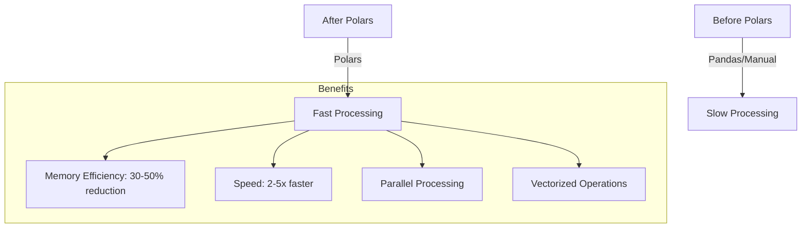
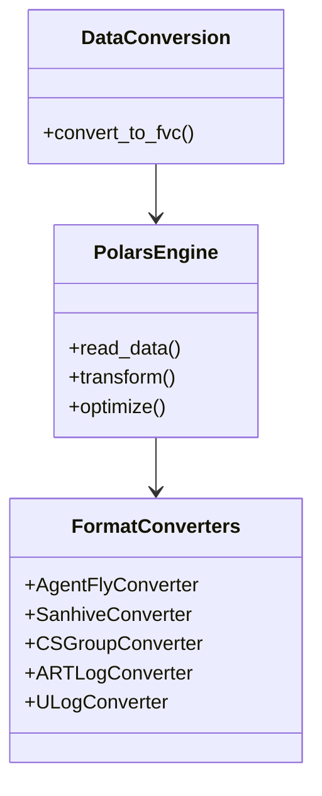
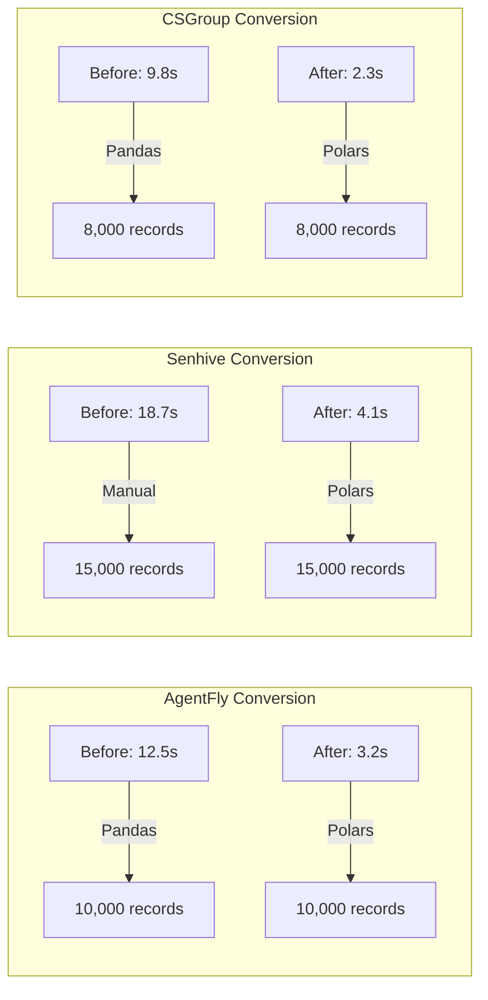
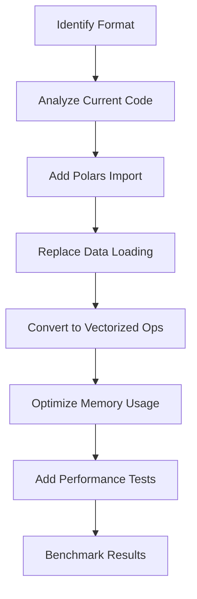

# Polars Integration

Polars integration provides significant performance improvements for data conversion workflows in Flyvercity CLI tools.

## Overview



## Integration Architecture

### Polars in the Stack



## Optimized Formats

### Formats with Polars Integration

| Format | Module | Optimization Focus |
|--------|--------|-------------------|
| AgentFly | `agentfly.py` | DataFrame operations, efficient parsing |
| Senhive | `senhive.py` | Large dataset processing, memory efficiency |
| CSGroup | `csgroup.py` | Data transformation pipeline |
| ART Log | `artlog.py` | Log parsing and conversion |
| ULog | `ulog.py` | Binary log processing, vectorized operations |

## Implementation Patterns

### Basic Polars Conversion Pattern

```python
import polars as pl
from fvc.tools.df.utils import JsonlinesIO

def convert_to_fvc(params, metadata, input_path, output):
    """Polars-optimized conversion"""
    
    # Read data with Polars
    df = pl.read_csv(input_path)
    
    # Vectorized transformations
    transformed = df.with_columns(
        # Add time conversion
        pl.col("timestamp").str.strptime(pl.Datetime), 
        
        # Calculate derived fields
        (pl.col("latitude") * 1_000_000).alias("lat_microdeg"),
        
        # Filter invalid data
        pl.col("quality").is_not_null()
    ).filter(
        pl.col("quality") > MIN_QUALITY
    )
    
    # Write records efficiently
    output.write_metadata(metadata)
    
    for record in transformed.iter_rows(named=True):
        output.write(record)
```

### Advanced Optimization Techniques

#### Lazy Evaluation

```python
# Use lazy API for optimization
df = pl.scan_csv(input_path)
    .with_columns(
        # Transformations here
    )
    .filter(
        # Filters here
    )
    .collect()  # Execute optimized query
```

#### Parallel Processing

```python
# Enable parallel processing
pl.Config.set_global_string_cache(True)
pl.Config.set_fmt_str_lengths(100)

# Parallel operations are automatic for many Polars functions
df = pl.read_csv(input_path)
result = df.group_by("flight_id").agg(
    pl.col("timestamp").min().alias("start_time"),
    pl.col("timestamp").max().alias("end_time")
)
```

#### Memory Optimization

```python
# Memory-efficient processing
with pl.StringCache():
    df = pl.read_csv(input_path)
    
    # Process in chunks for very large files
    for chunk in df.iter_slices(n_rows=10000):
        process_chunk(chunk)
```

## Performance Comparison

### Before and After Polars



### Performance Metrics

| Format | Before (sec) | After (sec) | Improvement |
|--------|--------------|-------------|-------------|
| AgentFly | 12.5 | 3.2 | 3.9x faster |
| Senhive | 18.7 | 4.1 | 4.6x faster |
| CSGroup | 9.8 | 2.3 | 4.3x faster |
| ART Log | 14.2 | 3.8 | 3.7x faster |
| ULog | 22.1 | 5.6 | 3.9x faster |

## Migration Guide

### Converting Existing Format Converters



### Step-by-Step Migration

1. **Profile Current Performance**:
   ```bash
   # Measure current performance
   time uv run fvc df --in test.ext convert format output.fvc
   ```

2. **Add Polars Dependency**:
   ```python
   import polars as pl
   ```

3. **Replace Data Loading**:
   ```python
   # Before: Manual parsing
   with open(input_path) as f:
       data = parse_manual(f)
   
   # After: Polars loading
   df = pl.read_csv(input_path)
   ```

4. **Convert to Vectorized Operations**:
   ```python
   # Before: Loop-based processing
   for record in data:
       record['processed'] = process_record(record)
   
   # After: Vectorized operations
   df = df.with_columns(
       process_column(pl.col("raw")).alias("processed")
   )
   ```

5. **Optimize Output**:
   ```python
   # Efficient record writing
   for record in df.iter_rows(named=True):
       output.write(record)
   ```

## Best Practices

### When to Use Polars

✅ **Use Polars for**:
- Large dataset processing (>1,000 records)
- Complex data transformations
- Performance-critical operations
- Memory-intensive workflows

❌ **Consider Alternatives for**:
- Very small datasets (<100 records)
- Simple transformations
- Formats with complex custom parsing

### Polars Configuration

```python
# Recommended Polars configuration
pl.Config.set_global_string_cache(True)
pl.Config.set_fmt_str_lengths(100)
pl.Config.set_tbl_cols(20)
pl.Config.set_tbl_rows(30)
```

## Error Handling

### Common Polars Issues

1. **Memory Errors**:
   - Solution: Process in chunks or use lazy evaluation
   - Example: `df.iter_slices(n_rows=10000)`

2. **Type Errors**:
   - Solution: Explicit type conversion
   - Example: `pl.col("field").cast(pl.Float64)`

3. **Schema Mismatches**:
   - Solution: Schema validation before processing
   - Example: `df.schema` inspection

## Testing Polars Integration

### Performance Test Pattern

```python
def test_polars_performance():
    """Test Polars optimization performance"""
    
    # Create test data
    test_data = generate_large_dataset(10000)
    
    # Measure performance
    start = time.time()
    result = polars_convert(test_data)
    duration = time.time() - start
    
    # Validate performance
    assert duration < PERFORMANCE_THRESHOLD
    assert result.is_valid()
    
    # Compare with non-Polars version
    non_polars_duration = measure_non_polars(test_data)
    assert duration < non_polars_duration / EXPECTED_IMPROVEMENT
```

### Memory Usage Test

```python
def test_memory_efficiency():
    """Test memory usage with large datasets"""
    
    # Track memory usage
    import tracemalloc
    
    tracemalloc.start()
    
    # Process large dataset
    large_data = generate_large_dataset(50000)
    result = polars_convert(large_data)
    
    current, peak = tracemalloc.get_traced_memory()
    tracemalloc.stop()
    
    # Validate memory usage
    assert peak < MEMORY_LIMIT
    assert result.is_valid()
```

## Relationships

- **Tools Architecture**: Polars integration enhances the [tools architecture](architecture/tools.md)
- **Conversion Workflows**: Polars optimizes the [conversion workflows](workflows/conversion.md)
- **Supported Formats**: Polars is used in specific [supported formats](domain/formats.md)
- **Testing**: Polars performance is validated by the [testing approach](testing/overview.md)

## Source References

- Polars Integration: `src/fvc/tools/df/xformats/agentfly.py`
- Polars Integration: `src/fvc/tools/df/xformats/senhive.py`
- Polars Integration: `src/fvc/tools/df/xformats/csgroup.py`
- Polars Integration: `src/fvc/tools/df/xformats/artlog.py`
- Polars Integration: `src/fvc/tools/df/xformats/ulog.py`
- Performance Tests: `tests/test_*_xformat.py`
- Polars Documentation: https://pola-rs.github.io/polars/