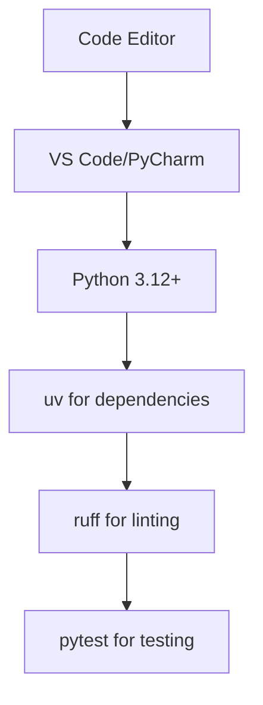
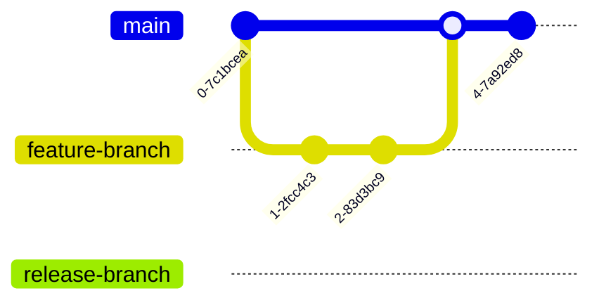
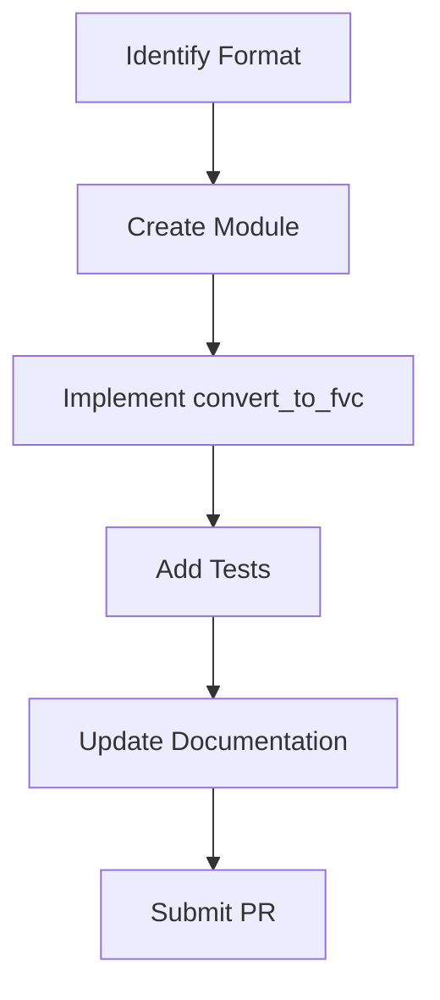
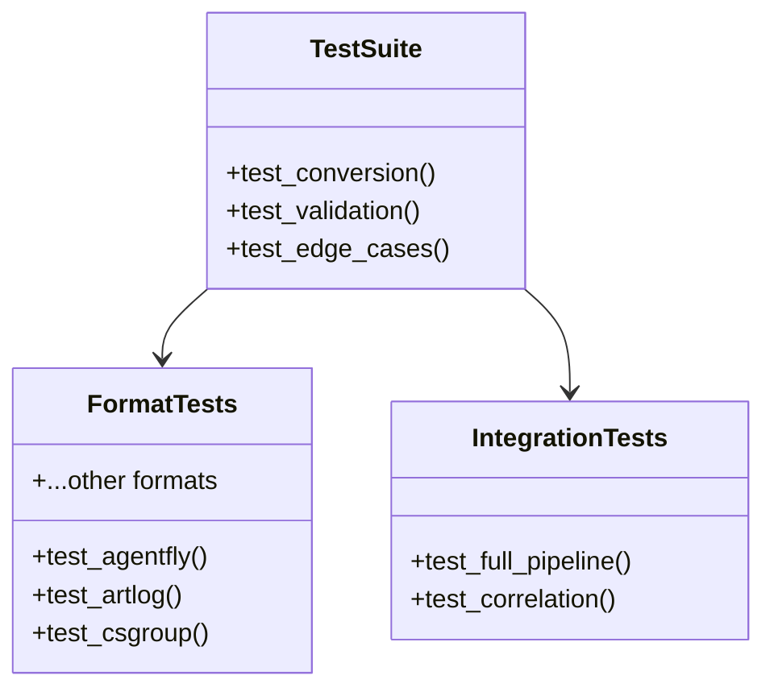
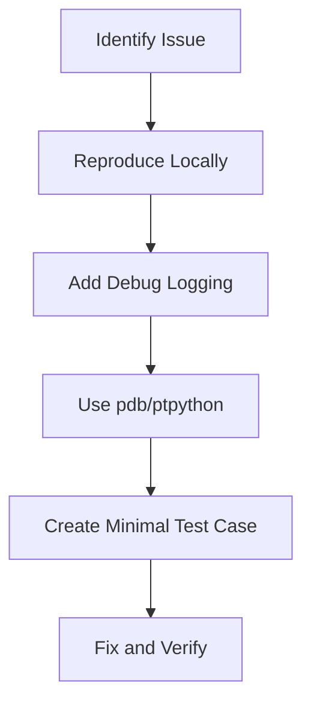
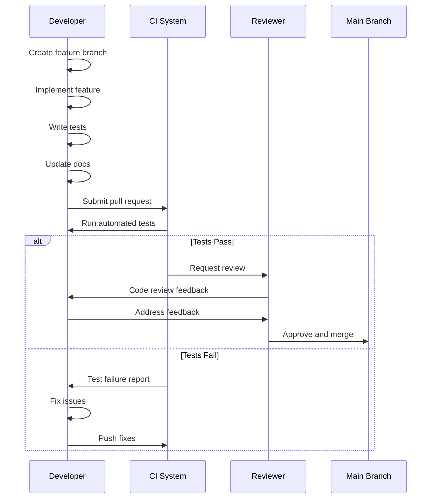

# Development Workflow

Guide to developing, testing, and contributing to the Flyvercity CLI Tools Suite.

## Development Environment

### Recommended Setup



### IDE Configuration

- **Python Extension**: For code intelligence
- **Ruff Extension**: For real-time linting
- **Pytest Integration**: For test running
- **Jupyter Support**: For data exploration

## Development Practices

### Code Style

- **Line Length**: 120 characters (configured in `pyproject.toml`)
- **Quote Style**: Single quotes (configured in `pyproject.toml`)
- **Formatting**: Use `ruff format` for consistent formatting
- **Linting**: Use `ruff check` for code quality

### Git Workflow



## Adding New Features

### Adding a New Data Format



#### Step-by-Step

1. **Create format module**:
   ```bash
   touch src/fvc/tools/df/xformats/newformat.py
   ```

2. **Implement converter**:
   ```python
   def convert_to_fvc(params, metadata, input_path, output):
       """Convert newformat to FVC"""
       # Parse input format
       # Transform to FVC records
       # Write using output handler
   ```

3. **Add tests**:
   ```bash
   touch tests/test_newformat_xformat.py
   ```

4. **Update CLI**: Add format to available converters

5. **Document format**: Update format documentation

### Optimization Guidelines

For performance-critical formats, consider Polars integration:

```python
import polars as pl

def convert_to_fvc(params, metadata, input_path, output):
    # Use Polars for efficient data processing
    df = pl.read_csv(input_path)
    
    # Vectorized operations
    transformed = df.with_columns(
        # Add transformations here
    )
    
    # Write records efficiently
    for record in transformed.iter_rows(named=True):
        output.write(record)
```

## Testing

### Test Structure



### Running Tests

```bash
# Run all tests
uv run pytest

# Run specific test
uv run pytest tests/test_agentfly_xformat.py

# Run with verbose output
uv run pytest -v

# Run tests with coverage
uv run pytest --cov=src --cov-report=term
```

### Test Coverage

Focus areas for testing:
- **Format Conversion**: Each format should have conversion tests
- **Edge Cases**: Invalid data, missing fields, boundary conditions
- **Performance**: Large file handling, memory usage
- **Integration**: Full pipeline testing

## Code Quality

### Linting and Formatting

```bash
# Check code quality
uv run ruff check .

# Auto-format code
uv run ruff format .

# Check specific file
uv run ruff check src/fvc/tools/df/xformats/newformat.py
```

### Common Linting Issues

1. **Line Length**: Keep lines under 120 characters
2. **Unused Imports**: Remove unused imports
3. **Type Hints**: Use proper type annotations
4. **Docstrings**: Document public functions and classes

## Debugging

### Debugging Tools

- **ptpython**: Enhanced REPL for interactive debugging
- **pdb**: Python debugger for complex issues
- **Logging**: Comprehensive logging throughout the codebase
- **Rich Output**: Colorized and formatted output for better visibility

### Debugging Workflow



## Contribution Process

### Pull Request Workflow



### Code Review Guidelines

1. **Functionality**: Does the code work as intended?
2. **Performance**: Are there obvious performance issues?
3. **Readability**: Is the code clear and well-documented?
4. **Testing**: Are there comprehensive tests?
5. **Documentation**: Is the feature documented?

## Relationships

- **Setup Guide**: Development workflow builds on the [setup and installation](setup.md)
- **Tools Architecture**: Development creates and maintains the [tools architecture](architecture/tools.md)
- **Testing**: Development includes comprehensive [testing approach](testing/overview.md)
- **Polars Integration**: Development can add new [Polars optimizations](integrations/polars.md)

## Source References

- Development Scripts: `scripts/`
- Test Suite: `tests/`
- Linting Config: `pyproject.toml`
- Contribution Guidelines: `CONTRIBUTING.md` (if exists)
- Git Hooks: `.git/hooks/` (if configured)