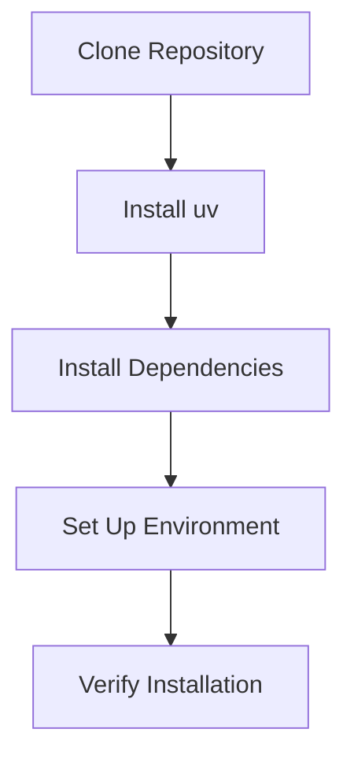
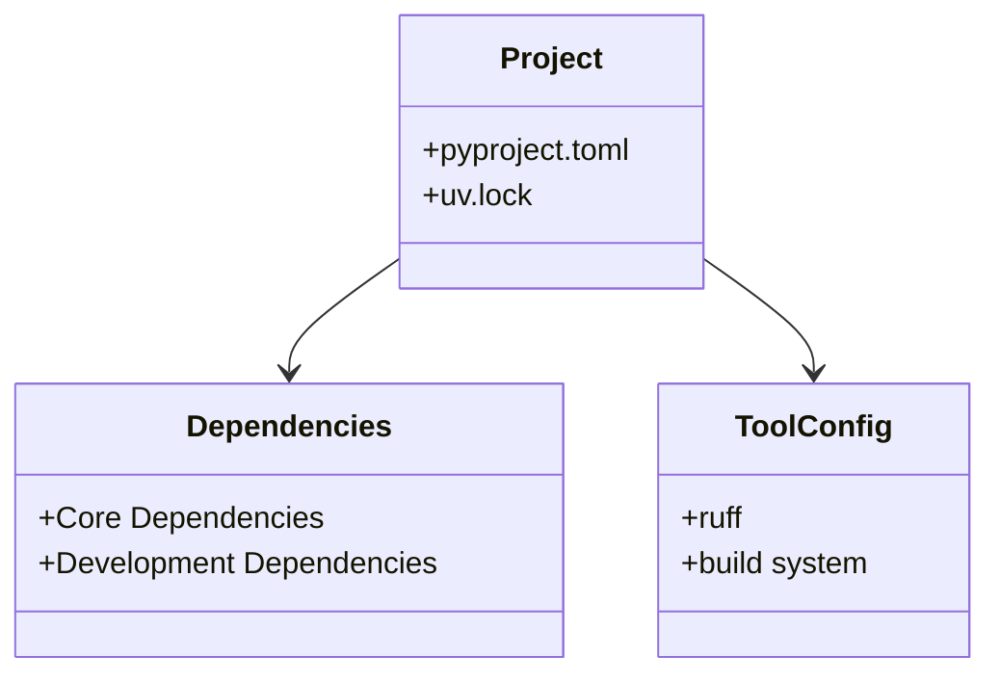

# Setup and Installation

Comprehensive guide to setting up the Flyvercity CLI Tools Suite development and runtime environment.

## Prerequisites

### System Requirements

- **Python**: 3.12 or higher
- **Operating System**: Windows, Linux, or macOS
- **Package Manager**: uv (recommended) or pip
- **Build Tools**: Standard Python development tools

### Required Tools

- **uv**: For dependency management (recommended)
- **git**: For source code management
- **Python 3.12+**: Core runtime requirement

## Installation Methods

### Development Installation



#### Step-by-Step

1. **Clone the repository**:
   ```bash
   git clone https://github.com/flyvercity/fvctools.git
   cd fvctools
   ```

2. **Install uv** (if not already installed):
   ```bash
   pip install uv
   ```

3. **Install dependencies**:
   ```bash
   uv sync
   ```

4. **Verify installation**:
   ```bash
   uv run fvc --help
   ```

### Production Installation

For production environments, use the package directly:

```bash
# Install from source
uv pip install .

# Or install from package registry (when available)
uv pip install fvctools
```

## Platform-Specific Setup

### Windows/PowerShell

```pwsh
# Authenticate to CodeArtifact
.\scripts\Login-ToCodeArtifact.ps1

# Install tools
.\scripts\Install-FvcTools.ps1

# Load into session
. .\pwsh\Load-FvcTools.ps1
```

### Linux/macOS (Bash)

```bash
# Authenticate to CodeArtifact
source scripts/Login-ToCodeArtifact.sh

# Install tools  
./scripts/Install-FvcTools.sh
```

## Dependency Management

### Project Structure



### Core Dependencies

Key dependencies from `pyproject.toml`:

- **Data Processing**: `polars`, `pandas`, `pygeodesy`
- **Geospatial**: `geopandas`, `rasterio`
- **CLI**: `click`, `rich`
- **Data Formats**: `pyulog`, `pynmea2`, `simplekml`
- **AWS**: `boto3`, `botobuddy`
- **Utilities**: `python-benedict`, `toolz`

### Development Dependencies

- **Testing**: `pytest`
- **Linting**: `ruff`
- **REPL**: `ptpython`
- **Tools**: `duct`, `jsonschema2md`

## Environment Configuration

### Virtual Environment

```bash
# Create virtual environment
python -m venv .venv

# Activate (Windows)
.\.venv\Scripts\activate

# Activate (Unix)
source .venv/bin/activate

# Install with uv
uv sync
```

### Dependency Groups

The project uses dependency groups in `pyproject.toml`:

- **Main Dependencies**: Core runtime requirements
- **Dev Dependencies**: Development and testing tools

Recent changes:
- Removed `flake8` from dependency groups
- Reorganized `pyproject.toml` structure for clarity

## Build and Distribution

### Building the Package

```bash
# Build wheel
uv pip install build
uv pip wheel . --no-deps

# Build sdist
uv pip sdist .
```

### Installation from Local Build

```bash
uv pip install dist/fvctools-*.whl
```

## Troubleshooting

### Common Issues

1. **Dependency Conflicts**:
   - Solution: Use `uv sync` to resolve conflicts
   - Check `uv.lock` for exact versions

2. **Python Version**:
   - Ensure Python 3.12+ is used
   - Check with `python --version`

3. **Missing Build Tools**:
   - Install build essentials for your platform
   - On Ubuntu: `sudo apt-get install build-essential`

4. **CodeArtifact Authentication**:
   - Run authentication scripts before installation
   - Check AWS credentials and permissions

## Relationships

- **Development Workflow**: Setup integrates with [development workflow](development.md)
- **Tools Architecture**: Environment supports the [tools architecture](architecture/tools.md)
- **Polars Integration**: Setup includes Polars for [optimized processing](integrations/polars.md)

## Source References

- Project Configuration: `pyproject.toml`
- Dependency Lock: `uv.lock`
- Installation Scripts: `scripts/`
- PowerShell Integration: `pwsh/`
- CLI Entry: `src/fvc/tools/cli.py`