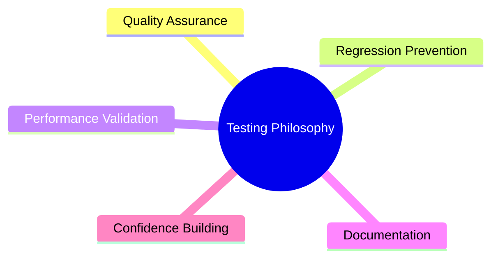

# Testing Approach

Comprehensive testing strategy for the Flyvercity CLI Tools Suite.

## Testing Philosophy



### Key Principles

1. **Comprehensive Coverage**: Test all major functionality
2. **Automation**: All tests should be automatable
3. **Performance**: Include performance testing for critical paths
4. **Maintainability**: Tests should be easy to understand and update
5. **Realism**: Test with real-world data when possible

## Test Architecture

<!-- openwiki: mermaid parse failed and this diagram was converted to a text fence so it does not break rendering. Fix the diagram source and restore the mermaid fence. Parser error: Heuristic: an unescaped angle bracket inside a label breaks rendering; rephrase the label. -->
```text
classDiagram
    class TestSuite {
        +Format Conversion Tests
        +Validation Tests
        +Integration Tests
        +Performance Tests
    }
    
    class TestBase {
        <<abstract>>
        +setup()
        +teardown()
        +create_test_data()
    }
    
    class FormatTest {
        +test_conversion()
        +test_edge_cases()
        +test_performance()
    }
    
    TestSuite --> TestBase
    TestBase <|-- FormatTest
```

## Test Categories

### Unit Tests

- **Scope**: Individual functions and modules
- **Focus**: Input/output behavior, edge cases
- **Examples**: Format parser functions, validation logic

### Integration Tests

- **Scope**: Multiple components working together
- **Focus**: Data flow between modules
- **Examples**: Full conversion pipeline, validation integration

### Format Conversion Tests

- **Scope**: Complete format conversion workflows
- **Focus**: End-to-end conversion quality
- **Examples**: `test_agentfly_xformat.py`, `test_senhive_xformat.py`

### Performance Tests

- **Scope**: Performance-critical operations
- **Focus**: Speed, memory usage, scalability
- **Examples**: Large file conversion, Polars optimization validation

## Test Implementation

### Test Structure

```python
# Typical test file structure
def test_basic_conversion():
    """Test basic format conversion"""
    # Setup test data
    input_data = create_test_data()
    
    # Execute conversion
    result = convert_to_fvc(input_data)
    
    # Validate output
    assert result.is_valid()
    assert len(result.records) > 0

def test_edge_cases():
    """Test edge cases and error handling"""
    # Test invalid data
    with pytest.raises(ValidationError):
        convert_to_fvc(invalid_data)
    
    # Test boundary conditions
    assert convert_to_fvc(boundary_data).is_valid()
```

### Test Data Management

- **Real Data**: Use real-world samples when possible
- **Synthetic Data**: Generate test data for edge cases
- **Data Isolation**: Keep test data separate from source code
- **Data Versioning**: Track test data changes

## Running Tests

### Test Execution

```bash
# Run all tests
uv run pytest

# Run specific test file
uv run pytest tests/test_agentfly_xformat.py

# Run tests with verbose output
uv run pytest -v

# Run tests matching pattern
uv run pytest -k "agentfly"

# Run tests with coverage
uv run pytest --cov=src --cov-report=term

# Generate HTML coverage report
uv run pytest --cov=src --cov-report=html
```

### Test Configuration

Configure pytest behavior in `pyproject.toml` or `pytest.ini`:

```ini
[pytest]
testpaths = tests
python_files = test_*.py
python_functions = test_*
addopts = --tb=short -v
```

## Performance Testing

### Performance Test Pattern

```python
def test_large_file_conversion_performance():
    """Test conversion performance with large files"""
    # Create large test file
    large_data = generate_large_dataset(10000)
    
    # Measure conversion time
    start_time = time.time()
    result = convert_to_fvc(large_data)
    duration = time.time() - start_time
    
    # Validate performance
    assert duration < PERFORMANCE_THRESHOLD
    assert result.is_valid()
```

### Performance Metrics

- **Conversion Speed**: Records per second
- **Memory Usage**: Peak memory consumption
- **Scalability**: Performance with increasing data size
- **Resource Utilization**: CPU usage patterns

## Test Coverage

### Current Test Coverage

| Area | Test Files | Coverage |
|------|------------|----------|
| AgentFly | `test_agentfly_xformat.py` | Conversion, validation |
| ART Log | `test_artlog_xformat.py` | Conversion, edge cases |
| CSGroup | `test_csgroup_xformat.py` | Conversion, performance |
| GeoJSON/KML | `test_geojson_kml_xformat.py` | Conversion, validation |
| Manna | `test_manna_xformat.py` | Conversion, integration |
| Senhive | `test_senhive_xformat.py` | Conversion, Polars optimization |
| ULog | `test_ulog_xformat.py` | Conversion, binary processing |
| Utilities | `test_utils.py` | Core utilities, helpers |
| Render | `test_render_core.py` | Visualization, output |
| Security | `verify_ps_security.py` | PowerShell security |

### Coverage Improvement Areas

1. **Additional Format Tests**: Ensure all formats have comprehensive tests
2. **Performance Benchmarks**: Add performance tests for all Polars-optimized formats
3. **Integration Tests**: More end-to-end pipeline tests
4. **Edge Case Coverage**: Expand boundary condition testing

## Continuous Integration

### CI Pipeline

```mermaid
flowchart LR
    A[Code Push] --> B[Run Linter]
    B --> C[Run Unit Tests]
    C --> D[Run Integration Tests]
    D --> E[Generate Coverage]
    E --> F[Build Package]
    F --> G[Deploy (if main)]
```

### CI Configuration

Typical CI steps:

```yaml
steps:
  - name: Install dependencies
    run: uv sync
  
  - name: Run linter
    run: uv run ruff check .
  
  - name: Run tests
    run: uv run pytest
  
  - name: Generate coverage
    run: uv run pytest --cov=src --cov-report=xml
  
  - name: Build package
    run: uv pip wheel . --no-deps
```

## Test Maintenance

### Updating Tests

1. **When Code Changes**: Update affected tests
2. **When Requirements Change**: Add new test cases
3. **When Bugs Found**: Add regression tests
4. **Regularly**: Review and improve test coverage

### Test Refactoring

- **Extract Common Setup**: Use fixtures for repeated setup
- **Parameterize Tests**: Reduce duplication with parameterization
- **Improve Readability**: Clear test names and structure
- **Update Documentation**: Keep test docs current

## Relationships

- **Development Workflow**: Testing is part of the [development workflow](operations/development.md)
- **Conversion Workflows**: Tests validate the [conversion workflows](workflows/conversion.md)
- **Tools Architecture**: Tests ensure the [tools architecture](architecture/tools.md) works correctly
- **Polars Integration**: Performance tests validate [Polars optimizations](integrations/polars.md)

## Source References

- Test Suite: `tests/`
- Test Configuration: `pyproject.toml`
- Test Utilities: `tests/conftest.py` (if exists)
- CI Configuration: `.github/workflows/` (if exists)