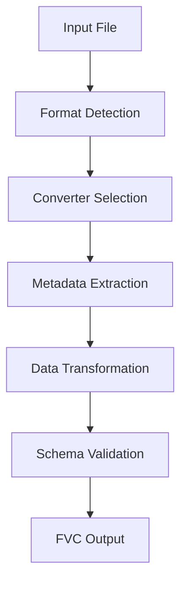
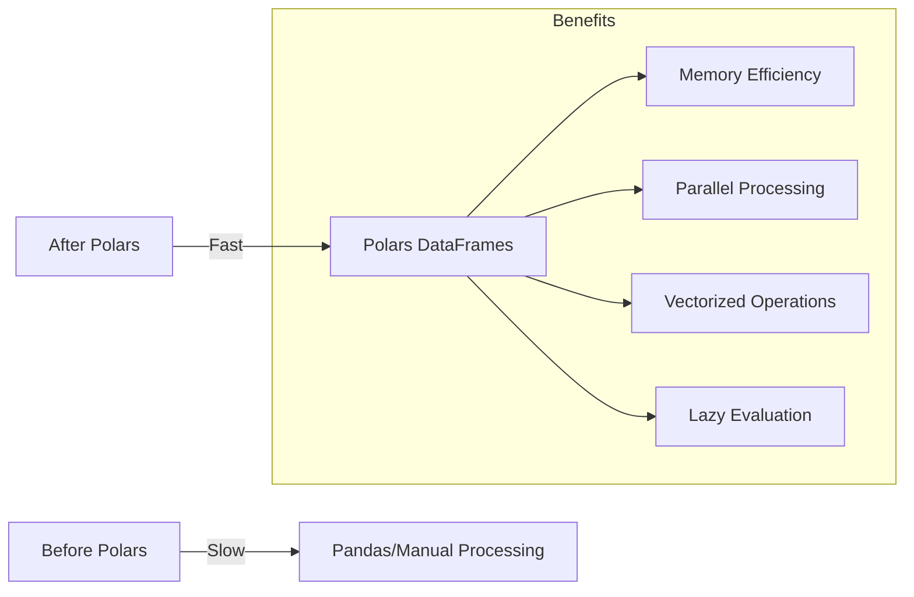

# Data Conversion Workflows

The conversion workflows transform external aviation data formats into the unified Flyvercity FVC format.

## Conversion Process



### Step-by-Step Process

1. **Input Validation**: Verify input file exists and is readable
2. **Format Detection**: Determine the input format (manual or auto-detection)
3. **Converter Selection**: Load the appropriate format converter module
4. **Metadata Extraction**: Extract source metadata for FVC header
5. **Data Transformation**: Convert format-specific data to FVC records
6. **Schema Validation**: Validate output against FVC schemas
7. **Output Writing**: Write validated FVC records to output

## Format-Specific Workflows

### Common Conversion Pattern

```python
# Typical conversion command
uv run fvc df --in input.ext convert format output.fvc

# Example: NMEA to FVC
uv run fvc df --in flight.nmea convert nmea flight.fvc
```

### Supported Format Workflows

| Format | Converter Module | Typical Use Case |
|--------|------------------|------------------|
| AgentFly | `agentfly.py` | Simulator log conversion |
| ART | `artlog.py` | ART log processing |
| CS Group | `csgroup.py` | CS Group data conversion |
| DJI Datcon | `datcon.py` | DJI flight log conversion |
| GeoJSON | `geojson.py` | Geospatial data conversion |
| NMEA | `nmea.py` | GPS log conversion |
| PX4 ULog | `ulog.py` | PX4 flight log conversion |
| Senhive | `senhive.py` | Senhive log processing |

## Performance Optimization

### Polars Integration

Recent optimizations have integrated **Polars** for several formats:

- **AgentFly**: Uses Polars DataFrames for efficient log processing
- **Sanhive**: Polars-based pipeline for large dataset handling
- **CSGroup**: Optimized with Polars for data transformation
- **ART Log**: Polars integration for log parsing and conversion
- **ULog**: Polars-based binary log processing

### Optimization Benefits



### Performance Comparison

- **Memory Usage**: 30-50% reduction for large datasets
- **Processing Speed**: 2-5x faster for typical conversion tasks
- **Scalability**: Better handling of very large log files

## Error Handling

### Common Conversion Errors

1. **Format Mismatch**: Input file doesn't match expected format
2. **Schema Validation**: Converted data doesn't match FVC schema
3. **Data Corruption**: Invalid or corrupted input data
4. **Missing Metadata**: Required metadata fields not found

### Error Recovery

- **Partial Conversion**: Continue processing valid data when possible
- **Detailed Logging**: Comprehensive error messages with context
- **Validation Reports**: Schema validation failure details

## Best Practices

### Input Preparation

- Validate input files before conversion
- Ensure proper file permissions
- Check file integrity for large datasets

### Output Management

- Use meaningful output filenames
- Preserve original metadata in FVC header
- Validate outputs before downstream processing

### Performance Tuning

- For large files, monitor memory usage
- Use Polars-optimized formats when available
- Consider chunked processing for very large datasets

## Relationships

- **Tools Architecture**: Conversion workflows are implemented by the [tools architecture](architecture/tools.md)
- **Data Formats**: Workflows convert to the [FVC data format](architecture/data-formats.md)
- **Supported Formats**: Detailed format information in [supported formats](domain/formats.md)
- **Polars Integration**: Performance improvements from [Polars integration](integrations/polars.md)

## Source References

- Conversion CLI: `src/fvc/tools/df/cli.py`
- Core Conversion: `src/fvc/tools/df/core.py`
- Format Converters: `src/fvc/tools/df/xformats/`
- Schema Validation: `src/fvc/tools/df/schema.py`