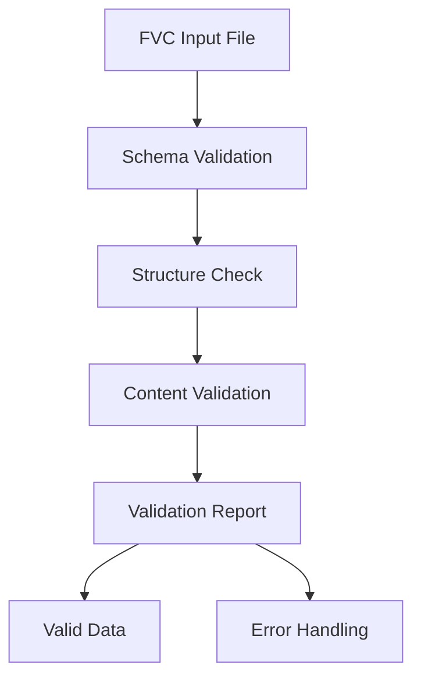
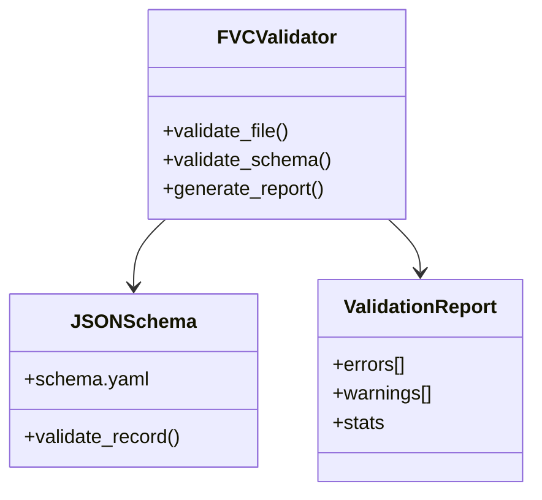
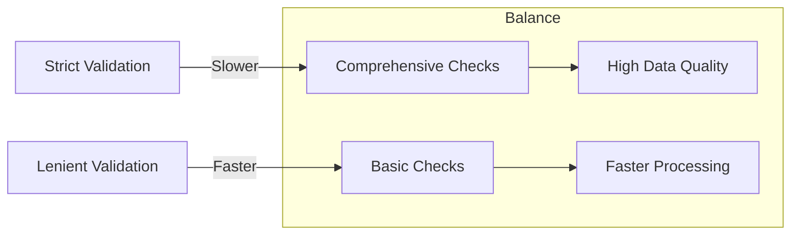
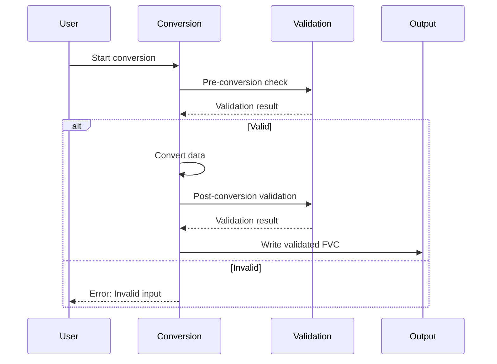

# Data Validation Workflows

Validation ensures that FVC files comply with project schemas and data quality standards.

## Validation Process



### Validation Stages

1. **File Structure**: Verify JSON-Lines format and line structure
2. **Metadata Validation**: Check first line is valid METADATA record
3. **Schema Compliance**: Validate data records against FVC schemas
4. **Content Validation**: Check data values and ranges
5. **Integrity Checks**: Verify data consistency and completeness

## Validation Commands

```bash
# Basic validation
uv run fvc df --in flight.fvc validate

# Detailed validation with reports
uv run fvc df --in flight.fvc validate --detailed
```

## Schema Validation

### Validation Components



### Schema Types Validated

1. **METADATA**: Content type, source, origin fields
2. **FLIGHTLOG**: Time, position, and flight parameter structure
3. **RADARLOG**: Time, position, and radar data structure
4. **CORRELATION**: Correlation result structure

## Error Handling

### Validation Error Types

1. **Schema Errors**: Data doesn't match expected structure
2. **Type Errors**: Wrong data types for fields
3. **Range Errors**: Values outside expected ranges
4. **Required Field Errors**: Missing mandatory fields
5. **Format Errors**: Invalid data formats (dates, coordinates, etc.)

### Error Reporting

```json
{
  "valid": false,
  "errors": [
    {
      "line": 42,
      "type": "schema_error",
      "field": "pos.loc.lat",
      "message": "Latitude must be between -90 and 90",
      "value": 102.5
    }
  ],
  "warnings": [
    {
      "line": 15,
      "type": "range_warning",
      "field": "altitude",
      "message": "Altitude value seems unusually high"
    }
  ]
}
```

## Validation Patterns

### Pre-Processing Validation

- Validate inputs before conversion workflows
- Ensure data quality before expensive processing
- Fail fast for invalid inputs

### Post-Conversion Validation

- Verify conversion output quality
- Catch conversion errors early
- Ensure downstream compatibility

### Continuous Validation

- Validate during data pipelines
- Monitor data quality over time
- Detect schema drift

## Performance Considerations

### Validation Optimization

- **Streaming Validation**: Process files line by line
- **Parallel Validation**: Validate multiple files concurrently
- **Schema Caching**: Cache parsed schemas for repeated validation
- **Selective Validation**: Validate only specific record types when possible

### Validation vs. Performance Tradeoffs



## Integration with Workflows

### Conversion Pipeline Integration



## Relationships

- **Data Formats**: Validation ensures compliance with [FVC data format](architecture/data-formats.md)
- **Conversion Workflows**: Validation integrates with [conversion workflows](conversion.md)
- **Tools Architecture**: Validation is implemented in the [tools architecture](architecture/tools.md)

## Source References

- Validation Engine: `src/fvc/tools/df/core.py`
- Schema Definitions: `src/fvc/tools/df/schema.yaml`
- Schema Code: `src/fvc/tools/df/schema.py`
- CLI Integration: `src/fvc/tools/df/cli.py`